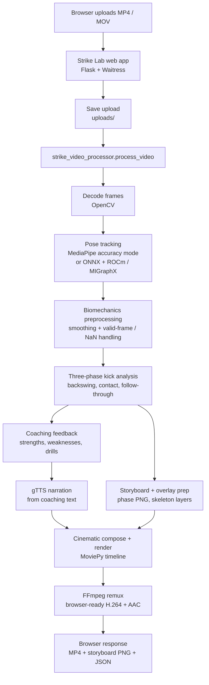
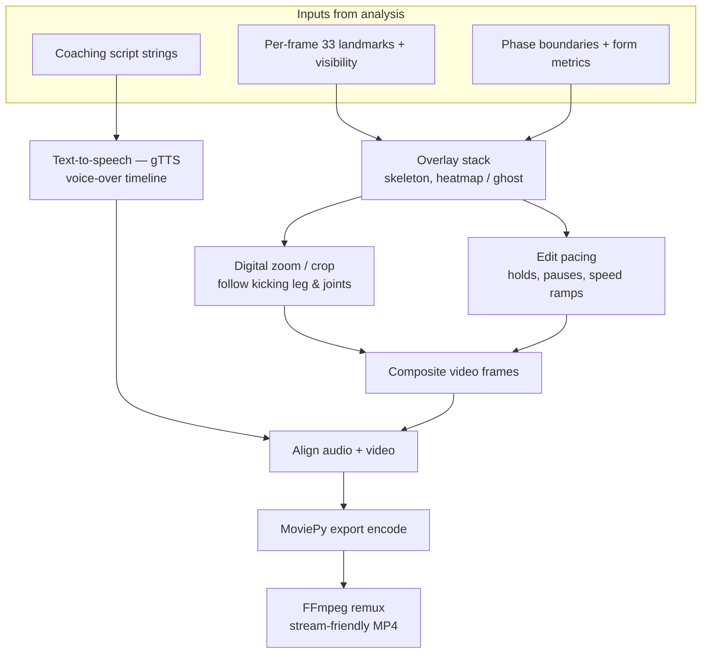
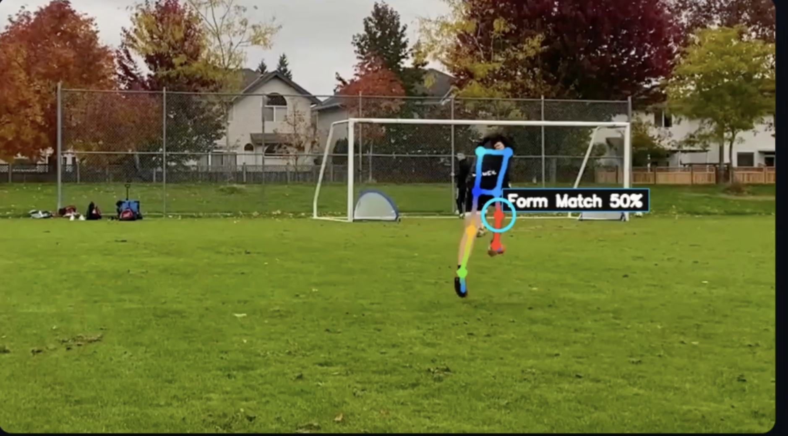
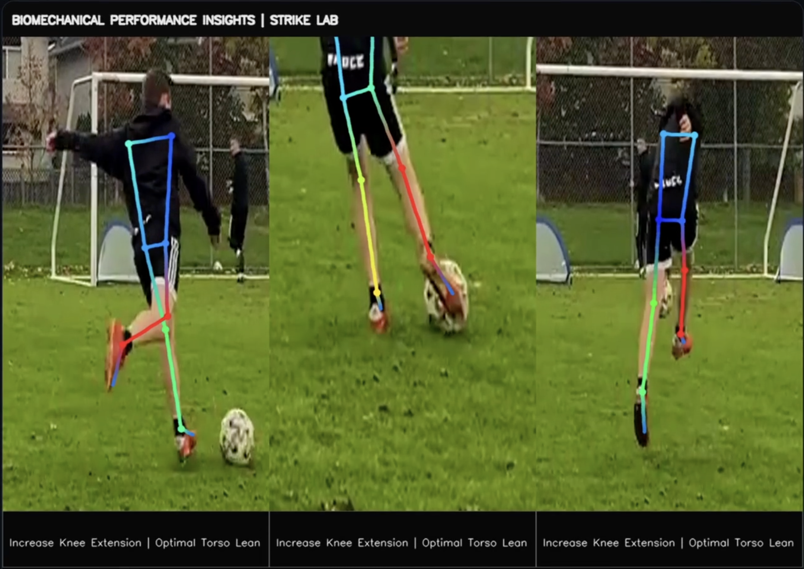
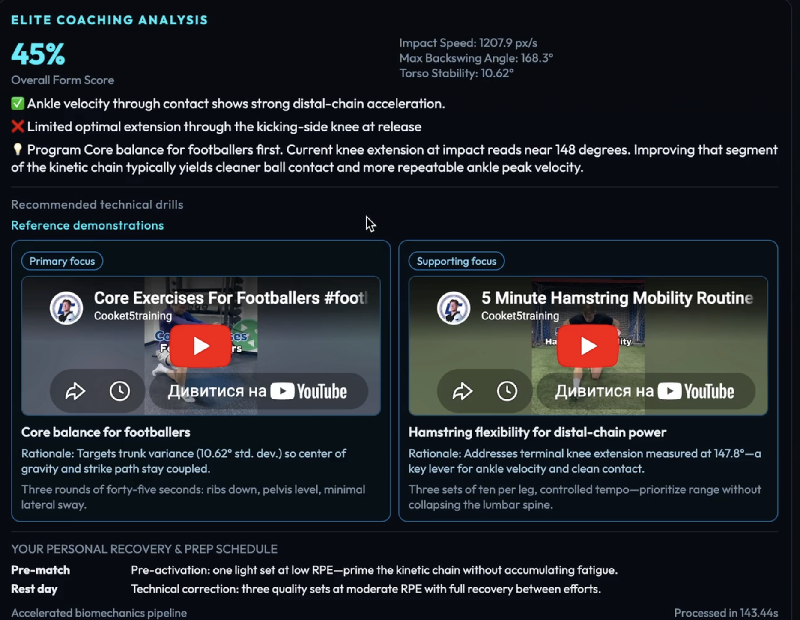

# [StrikeLab — Please open Hugging Face](https://huggingface.co/spaces/an2323/neuro-strike)

<div align="center">

### **START HERE — primary landing & live demo**

## **[Open StrikeLab on Hugging Face Spaces →](https://huggingface.co/spaces/an2323/neuro-strike)**

**[https://huggingface.co/spaces/an2323/neuro-strike](https://huggingface.co/spaces/an2323/neuro-strike)**

</div>

---

**StrikeLab** is a football strike biomechanics stack: pose estimation on strike footage, ghost / heatmap-style overlays, coaching metrics, and an optional **narrated cinematic analysis** export.

The project is optimized for **AMD ROCm on MI300X**. The accelerated path uses **ONNX Runtime**, **MIGraphXExecutionProvider**, ROCm / hipBLAS compatibility shims where needed, OpenCV, MoviePy, ffmpeg, and a MediaPipe-based accuracy mode for more stable multi-player footage.

The AMD infrastructure advantage is GPU-accelerated pose inference without CUDA. MI300X runs BlazePose-compatible ONNX models through ROCm and MIGraphX, while StrikeLab keeps a MediaPipe tracker path for reliability on crowded football footage. This moved the system from CPU-bound video analysis to a mixed GPU + optimized-render pipeline.

## ROCm Performance Summary


| Version               | Backend                                | End-to-end time | Notes                                                   |
| --------------------- | -------------------------------------- | --------------- | ------------------------------------------------------- |
| Original CPU path     | CPU MediaPipe                          | ~80s            | User-observed before ROCm work                          |
| Current accuracy mode | MediaPipe tracker + optimized renderer | 16.09s          | More stable skeleton / heatmap for multi-player footage |


Measured speedups:

- **Current accuracy mode:** `80s -> 16.09s`, about **5.0x faster**, while prioritizing tracking stability.

Latest stable run breakdown:


| Phase                                       | Time  |
| ------------------------------------------- | ----- |
| Upload / file handling                      | ~1.0s |
| Pose tracking + biomechanical preprocessing | ~7.7s |
| Storyboard / overlay preparation            | ~0.6s |
| MoviePy cinematic render / export           | ~6.5s |
| FFmpeg browser remux                        | ~0.1s |


Optimization steps applied:

1. Added a **ROCm + ONNX Runtime + MIGraphX** inference path on MI300X.
2. Preserved 33-landmark biomechanics by using BlazePose-compatible ONNX models instead of lower-keypoint pose models.
3. Added GPU fallback safety so the app can fall back to CPU / tracker paths when ROCm is unavailable.
4. Hardened NaN handling in cinematic overlays for frames with missing pose detections.
5. Optimized the render path so GPU acceleration moved the workload from minute-scale to seconds-scale.

Versus CPU, the current measured speedup is **~5.0x** while preserving stable tracking. We did not benchmark NVIDIA directly; the result shows this workload can run on an open **AMD ROCm + MI300X + ONNX Runtime + MIGraphX** stack instead of requiring CUDA.

## Strike Lab Pipeline

Two views of the same run: **(1) orchestration** from browser upload through artefacts, and **(2) cinematic manipulations** — what happens to pixels and audio when building the narrated MP4.

### 1. Orchestration (upload → analysis → deliverables)



### 2. Cinematic track (manipulations)

What the exporter applies on top of landmarks, phase splits, and coaching copy:



The repo contains **three runnable surfaces** that share the same biomechanical ideas but target different workflows:


| Component                       | Role                                                                                                                                         |
| ------------------------------- | -------------------------------------------------------------------------------------------------------------------------------------------- |
| **Strike Lab** (`app.py`)            | Web UI + **Flask** API: upload `.mp4` / `.mov`, run offline processing, download narrated MP4, storyboard PNG, and structured coaching JSON. |
| **`strike_video_processor.py`**    | CLI / library: full pipeline (MediaPipe → smoothing → narrated video + storyboard). Used by Strike Lab.                                         |
| **`remote_main.py`**               | **FastAPI** + **WebSockets**: high-concurrency remote analyzer for MI300X; binary + JPEG streaming (see code for protocol).                     |
| **`main.py`**                      | Smaller **FastAPI** app (e.g. local/dev) with upload/WebSocket paths; may default MediaPipe to CPU — check env in file.                        |


---

## What Strike Lab does

1. **Ingest** a short strike clip (MP4 or MOV).
2. **Estimate pose** with **MediaPipe Pose** at **model complexity 2** or BlazePose-compatible ONNX on ROCm / MIGraphX (33 landmarks).
3. **Smooth** trajectories (Savitzky–Golay where SciPy is available).
4. **Detect** strike phase, kicking leg, and biomechanical signals (e.g. ankle speed, joint angles, form match vs a corrected “ghost” template).
5. **Produce**:
   - A **video analysis MP4** with pauses, zooms, overlays, and **gTTS** narration.
   - A **three-phase kick analysis** storyboard.
   - **Coaching recommendations** with strengths, weaknesses, and exercise suggestions.

### Video Analysis With Pauses, Zoom, And TTS



### Three-Phase Kick Analysis



### Coaching Recommendations With Exercises



Processing expects **Linux + Python 3.10+** and a sane **ffmpeg/ffprobe** on `PATH` for H.264 remux and audio handling.

---

## Main technologies

- **Python 3** — NumPy, SciPy (temporal smoothing).
- **OpenCV** (`opencv-python-headless`) — decode/encode, overlays.
- **AMD ROCm + MI300X** — GPU acceleration target.
- **ONNX Runtime + MIGraphXExecutionProvider** — accelerated BlazePose-compatible inference path.
- **MediaPipe** — BlazePose / Pose tracker and accuracy fallback at model complexity 2.
- **Flask** + **Waitress** — Strike Lab HTTP server.
- **FastAPI** + **Uvicorn** — `remote_main.py` / `main.py`.
- **MoviePy** + **gTTS** — narrated export (optional deps are listed in `requirements.txt` comments).
- **ffmpeg** — browser-friendly H.264 + AAC pass after export.

Frontend for Strike Lab: **vanilla HTML/CSS/JS** (`templates/strike_index.html`, `static/script.js`).

---

## Quick start (Strike Lab)

From the repository root:

```bash
python3 -m venv neurostrike_env
source neurostrike_env/bin/activate   # Windows: neurostrike_env\Scripts\activate
pip install -r requirements.txt
bash scripts/fix_venv_opencv_numpy.sh   # strongly recommended once (OpenCV / NumPy / MediaPipe conflicts)
python app.py
```

Then open **[http://127.0.0.1:5050/](http://127.0.0.1:5050/)** (or host/port from env: `STRIKE_LAB_HOST`, `STRIKE_LAB_PORT`).

- **`STRIKE_LAB_DEV=1 python app.py`** — Flask development server instead of Waitress.

### Optional: remote MI300X stack

```bash
pip install -r requirements_remote.txt
bash scripts/fix_venv_opencv_numpy.sh   # if needed
# run per remote_main.py / deployment docs
```

---

## CLI (offline processor)

```bash
python strike_video_processor.py --input path/to/kick.mp4 --output path/to/out.mp4
```

Same pipeline as Strike Lab’s backend (narrated output path, storyboard, coaching). Additional optional deps may be listed in `requirements_strike_video.txt`.

---

## Project layout (high level)

```
app.py                    # Strike Lab Flask entry
templates/               # Strike Lab HTML
static/                    # Strike Lab JS/CSS
strike_video_processor.py # Core offline biomechanics + narrated export
remote_main.py            # FastAPI WebSocket server (MI300X / cloud)
main.py                   # Alternate FastAPI entry
scripts/                   # e.g. OpenCV/NumPy venv fix
uploads/  results/        # Runtime dirs for Strike Lab (created by app)
```

---

## Hardware notes

- **ROCm / MI300X**: Keep GPU enabled for MediaPipe on the remote server (`MEDIAPIPE_DISABLE_GPU=0` is the default in `remote_main.py`; align Strike Lab / workers with your deployment policy).
- Strike Lab’s **upload processor** is CPU-heavy (OpenCV + MediaPipe); GPU use depends on MediaPipe build and env — see MediaPipe and ROCm docs for your image.

---

## License / product

Add your license and trademark text here if applicable.
